# Magento 2 - Allegro Integration Module
Magento 2 Allegro Integration module. Supports Magento 2 >= v2.3

## Partners
Our partners helps to develop this project.
* [Macopedia.com](https://macopedia.com)
* [Oceanic](https://www.oceanic.com.pl)
* [Trefl](https://sklep.trefl.com/)

If you like to help our project - please let us know at [sales@macopedia.com](mailto:sales@macopedia.com)

## Current Backlog
* [Multi variants](https://github.com/macopedia/magento2-allegro/issues/1)
* [Multi sellers account handling](https://github.com/macopedia/magento2-allegro/issues/2)
* [Price policy & price automation](https://github.com/macopedia/magento2-allegro/issues/3)
* [Mass offers issuing](https://github.com/macopedia/magento2-allegro/issues/4)
* [Manual order handling - choosing correct simple product from configurable](https://github.com/macopedia/magento2-allegro/issues/5)
* [Mapping Allegro categories to Magento](https://github.com/macopedia/magento2-allegro/issues/6)
* [Mapping Allegro attributes to Magento](https://github.com/macopedia/magento2-allegro/issues/7)


## License 
Magento 2 - Allegro Integration Module source code is completely free and released under the [MIT License](https://github.com/macopedia/magento2-allegro/blob/master/LICENSE).

## Kolejność działań po instalacji modułu
1. Dodać konfiguracje kolejki w [MySQL MQ](https://github.com/macopedia/magento2-allegro#konfiguracja-mysql-mq) lub [RabbitMQ](https://github.com/macopedia/magento2-allegro#konfiguracja-rabbitmq)
2. Przejść do konfiguracji wtyczki oraz wybrać odpowiedni typ konta (Sklepy->Konfiguracja->Allegro->Konfiguracja)
3. [Połączyć się z kontem Allegro](https://github.com/macopedia/magento2-allegro#po%C5%82%C4%85czenie-z-kontem-allegro)
4. Wyłączyć import zamówień
5. Włączyć lub wyłączyć (według preferencji) synchronizacje stanów magazynowych oraz wysyłkę numerów przesyłek
6. [Powiązać metody dostawy oraz płatności](https://github.com/macopedia/magento2-allegro#mapowanie-metod-dostawy-i-p%C5%82atno%C5%9Bci)
7. [Powiązać oferty z produktami na Allegro](https://github.com/macopedia/magento2-allegro#powi%C4%85zanie-istniej%C4%85cych-ofert-allegro-z-produktami-w-sklepie-magento)
8. Włączyć import zamówień (według preferencji)

Import zamówień powinien zostać włączony, dopiero gdy wszystkie produkty są już powiązane z ofertami na Allegro - w przeciwnym wypadku zamówienie może zostać pominięte z powodu braku produktu, który odpowiadałby ofercie na Allegro.


## Połączenie z kontem Allegro
Aby połączyć sklep Magento z aplikacją Allegro należy wykonać następujące kroki:
1. Zalogować się na koncie Allegro i przejść na adres https://apps.developer.allegro.pl lub https://apps.developer.allegro.pl.allegrosandbox.pl dla konta sandboxowego, aby zarejestrować nową aplikację.
2. Wprowadzić nazwę aplikacji i adres URI do przekierowania - powinien on być w formacie {backend_url}/index.php/admin/allegro/system/authenticate/ - np. 'http://example.com/index.php/admin/allegro/system/authenticate/'.
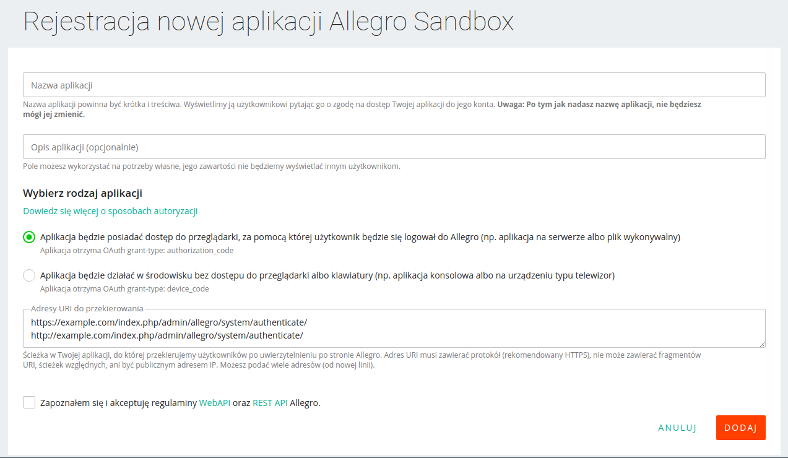
3. Zalogować się w panelu admina w Magento i przejść do sekcji Sklepy -> Konfiguracja -> Allegro -> Konfiguracja
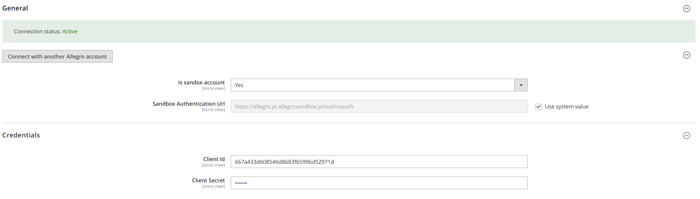
4. Wprowadzić w konfiguracji Magento wartości Client ID i Client Secret wygenerowane dla aplikacji Allegro i zmienić typ konta, jeśli działamy na koncie sandboxowym, a następnie zapisać zmiany.
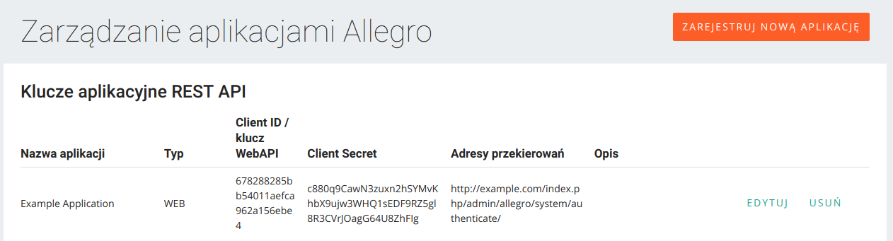
5. Kliknąć przycisk "Połącz z kontem Allegro" aby otrzymać token z aplikacji Allegro. Jeśli połączenie zostanie nawiązane pomyślnie, token będzie zapamiętany w aplikacji Magento, co umożliwi dalszą integrację z kontem Allegro.


## Powiązanie istniejących ofert Allegro z produktami w sklepie Magento
Przed włączeniem importu zamówień należy powiązać już istniejące oferty na Allegro z odpowiadającymi im produktami w sklepie Magento, aby to zrobić należy wykonać następujące kroki:

1. Wejść  w zakładkę "Moje oferty" na koncie Allegro
2. Skopiować ID oferty znajdujące się pod jej nazwą
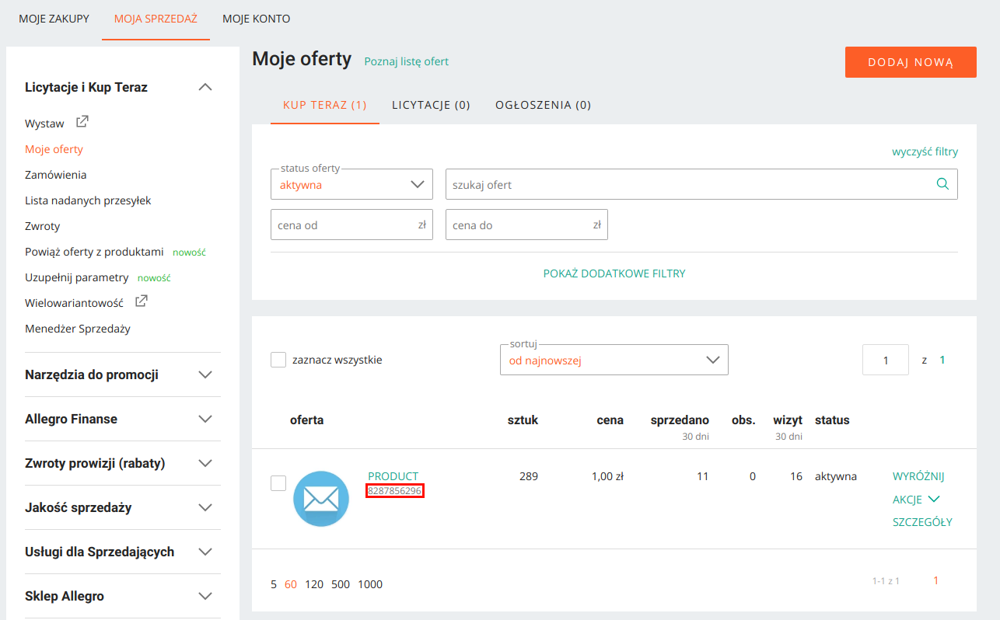
3. Wejść na stronę edycji produktu w Magento, który odpowiada ofercie Allegro
4. Wkleić skopiowane wcześniej ID oferty do pola Allegro→ Numer oferty Allegro i zapisać produkt
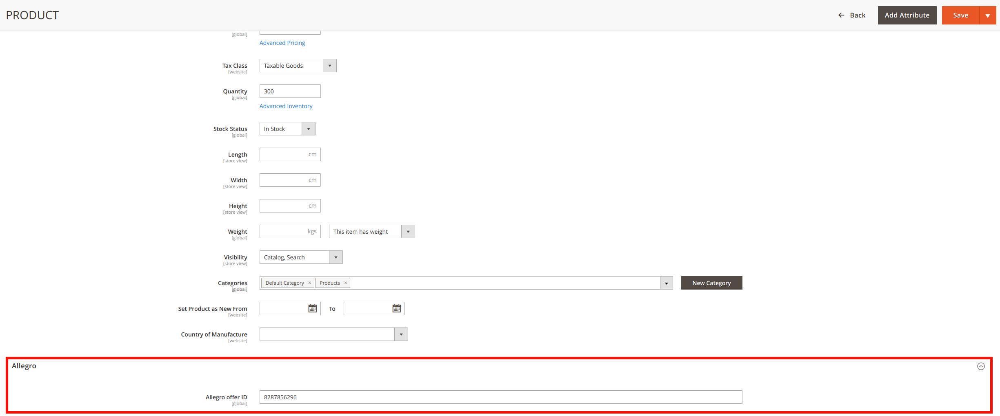


## Synchronizacja stanów magazynowych
Jednym z wielu zadań wtyczki jest dopilnowanie, aby liczba danego produktu na sklepie Magento,
powiązanego z odpowiednią ofertą w Allegro była stale taka sama zarówno na sklepie, jak i w
Allegro. Zadanie to spełnia realizując poniższe czynności:
1. Monitoruje każdorazowe wystąpienie zmiany w liczbie produktu (zakup lub ręczna zmiana w
panelu admina Magento) i pobiera ID produktu, w którym doszło do zmian.
2. Następnie przy pomocy RabbitMQ lub MySQL MQ przekazuje pobrane wcześniej ID produktu do kolejki, aby
synchronizacja przebiegała stopniowo, przechodząc po kolei po każdej wystąpionej zmianie
stanu magazynowego (dzięki temu stany magazynowe aktualizowane są na bieżąco zgodnie z
kolejnością zmian i odciąża system, ponieważ zmiany nie są wykonywane jednocześnie).
3. Gdy w kolejce zaczynają pojawiać się nowe ID produktów, Consumer - klasa odpowiadająca
za modyfikowanie stanów magazynowych ofert na Allegro, odbiera pierwszy ID z kolejki, a
następnie przy jego pomocy wyciąga informacje o aktualnym stanie magazynowym danego
produktu i przesyła go do Allegro w celu aktualizacji.

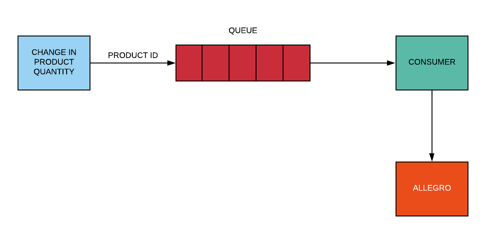

Synchronizację stanów magazynowych można włączać lub wyłączać w konfiguracji wtyczki.

## Integracja zamówień
Po nawiązaniu połączenia sklepu z aplikacją Allegro możemy włączyć w konfiguracji import zamówień.
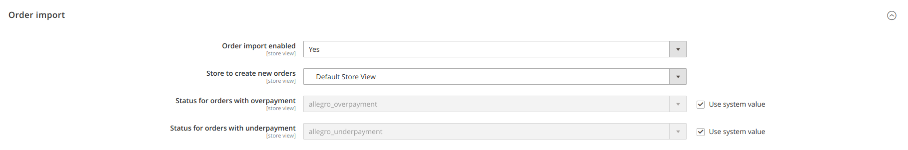

Po włączeniu tej opcji API Allegro będzie odpytywane co 5 minut o zdarzenia dotyczące zamówień. W ramach tego zapytania zamówienia będą importowane w sklepie Magento - dla nowych zamówień dodanych w Allegro będą tworzone zamówienia w sklepie Magento, a dla już istniejących będzie przeprowadzana ich aktualizacja.

W konfiguracji sklepu możemy również ustawić widok sklepu, do którego zamówienia z Allegro będą importowane.

W ramach importu zamówień z Allegro w sklepie Magento zapisywane są informacje o cenie i ilości zamówionego produktu, dane zamawiającego, dane o płatności i wysyłce oraz wiadomość do sprzedającego, która trafia do zakładki "Historia komentarzy" na stronie zamówienia.

Moduł obsługuje standardową logikę dla składania zamówień w Magento. Dostosowanie importowanych produktów można w projekcie przeprowadzić poprzez utworzenie obserwera dla eventu z nazwą "allegro_order_import_before_quote_save". Obserwer ten ma przekazane w parametrze wszystkie informacje udostępniane przez API Allegro dla zapytania o szczegóły zamówienia (https://developer.allegro.pl/en/orders/#04).

## Mapowanie metod dostawy i płatności
W konfiguracji wtyczki możemy definiować mapowanie metod płatności dla zamówień przychodzących z Allegro do sklepu Magento.


Dla mapowania metod dostawy mamy do dyspozycji dynamiczną listę, do której możemy dodawać kolejne pozycje, w których wybieramy w liście po lewej stronę jedną z metod dostawy dostępnych w Allegro, a w liście po prawej stronie nazwę metody dostawy dostępnej i aktywnej w konfiguracji sklepu Magento. Poniżej dynamicznej listy możemy wybrać domyślną metodę dostawy, która będzie przypisana do zamówienia w momencie, gdy z Allegro otrzymamy metodę, dla której nie zdefiniowaliśmy mapowania.

Dla mapowania metod płatności mamy do dyspozycji dwie listy rozwijane, w których możemy wybrać po jednej z dostępnych i aktywnych w konfiguracji sklepu Magento metod płatności - dla zamówień przychodzących z Allegro z płatnością online i dla zamówień z płatnością przy pobraniu. 

## Wysyłanie numerów przesyłek
Aby klient mógł śledzić przesyłkę z jego zamówieniem należy wprowadzić w Allegro jej numer oraz informacje o przewoźniku. Dzięki wtyczce można, to zrobić z poziomu Magento:
1. Należy wejść na stronę zamówienia, które zostało wcześniej zaimportowane z Allegro i otworzyć zakładkę 'Dostawa'.
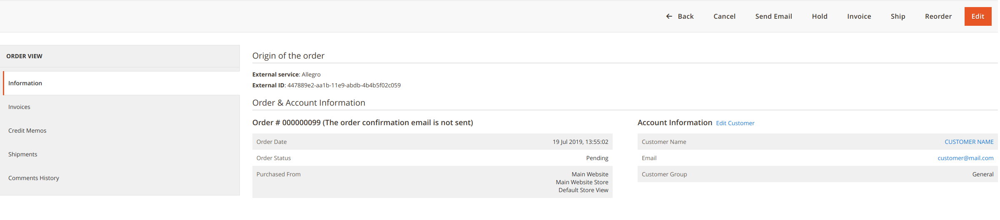
2. Następnie kliknąć 'Dodaj numer przesyłki', wybrać nazwę przewoźnika i wprowadzić numer do śledzenia przesyłki.
3. Można również wybrać, które produkty znajdują się w przesyłce poprzez ustawienie ilości produktu do wysłania:
    - 0 - produkt nie znajduje się w przesyłce.
    - liczba większa od 0 - produkt znajduje się w przesyłce w podanej ilości.
4. Można dodać wiele numerów przesyłek w zależności od ilości produktów w zamówieniu.    
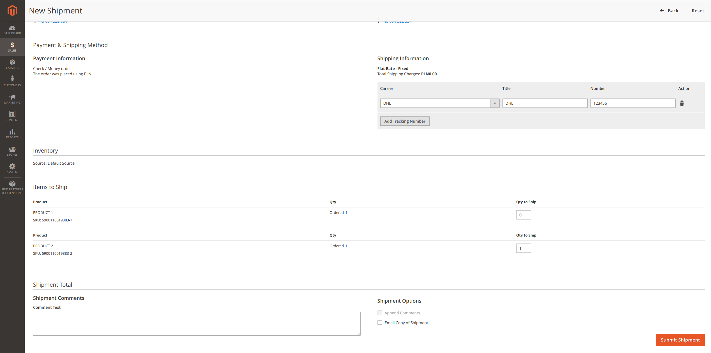

Wysyłkę numerów przesyłek można włączać lub wyłączać w konfiguracji wtyczki.

## Automatyczna zmiana statusu zamówienia na "Wysłane" w panelu Allegro

W panelu Allegro można ustawić automatyczną zmianę statusów na "Wysłane" po wprowadzeniu listu przewozowego do danego zamówienia. Należy jednorazowo wprowadzić ręcznie numer przesyłki dla danego zamówienia lub edytować już istniejący i zaznaczyć checkbox "Automatycznie zmieniaj status wszystkich zamówień na WYSŁANE po dodaniu numeru przesyłki". 
Aby to zrobić należy:
1. W panelu Magento, wygenerować etykietę wysyłkową dla zamowienia zaimportowanego z Allegro
2. Skopiować wygenerowany numer przesyłki
3. Zalogować się do platformy Allegro i wybrać zamówienie, do którego chcemy wprowadzić numer przesyłki lub zmienić już istniejący
4. Na liście zamówień na Allegro, przy zamówieniu do którego chcemy wprowadzić numer przesyłki, klikamy w listę rozwijaną AKCJE → wybieramy opcję NUMERY PRZESYŁEK
5. Otworzy nam się osobne okno z opcja do wybrania przewoźnika oraz do wprowadzenia numeru przesyłki.
6. W otwartym oknie należy zaznaczyć checkbox "Automatycznie zmieniaj status wszystkich zamówień na WYSŁANE po dodaniu numeru przesyłki" i kliknąć "ZAPISZ"

Po tym ustawieniu wszystkie zamówienia, które są na Allegro, które otrzymają z Magento numer listu przewozowego, mają status "Wysłane".


## Publikowanie ofert
Za pomocą wtyczki możemy wystawiać produkty z Magento na Allegro. Aby to zrobić należy:
1. Na koncie Allegro utworzyć [cennik dostaw](https://allegro.pl/pomoc/dla-sprzedajacych/cennik-dostawy/cenniki-dostawy-tworzenie-edycja-i-podmiana-B826XYWjvFg)
2. Dodać informacje o [zwrotach](https://allegro.pl/dla-sprzedajacych/warunki-oferty-zwroty-a124GwdXZFA), [reklamacji](https://allegro.pl/dla-sprzedajacych/warunki-oferty-reklamacje-vKgeWL5GnHA) oraz [gwarancji](https://allegro.pl/dla-sprzedajacych/warunki-oferty-gwarancje-9dXYn0VeXHM) na Allegro (wymagane tylko dla konta firmowego)
3. Uzupełnić informacje o loklizacji (Sklepy->Konfiguracja->Allegro->Konfiguracja->Pochodzenie)
    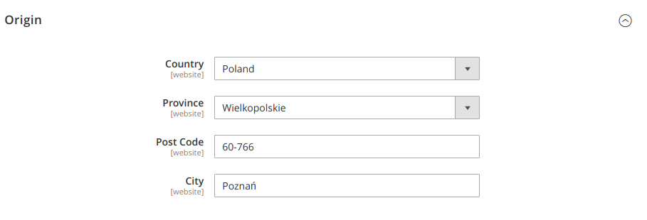

Po wprowadzeniu wymaganych danych można zacząć wystawiać oferty z poziomu Magento.
Należy wybrać produkt, który chcemy wstawić, wejść na jego stronę i wybrać zdjęcie do oferty Allegro. Żeby, to zrobić wystarczy kliknąć zdjęcie, zaznaczyć rolę 'Allegro', a następnie zapisać produkt.
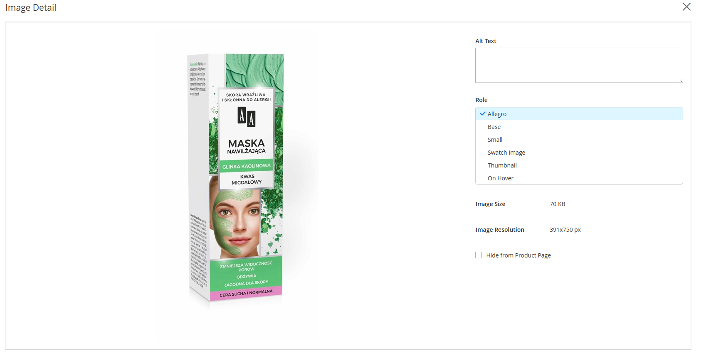

Teraz wystarczy już kliknąć przycisk "Dodaj na Allegro".
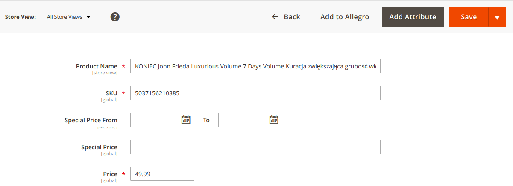

Zostaniemy przekierowani na stronę formularza wystawiania aukcji, na którym znajdują się pola:
1. Nazwa oferty - pobierana z produktu
2. Opis oferty - pobierany z produktu
3. Cena - pobierana z produktu
4. Ilość - pobierana z produktu
    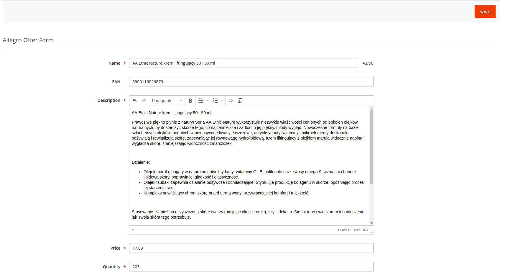
5. Cennik dostaw, warunki reklamacji, warunki zwrotów, warunki gwarancji - pobierane z podłączonego konta Allegro
6. Czas wysyłki, opcje faktury - uniwersalne parametry Allegro
7. Wybór kategorii
8. Parametry zależne od wybranej kategorii
    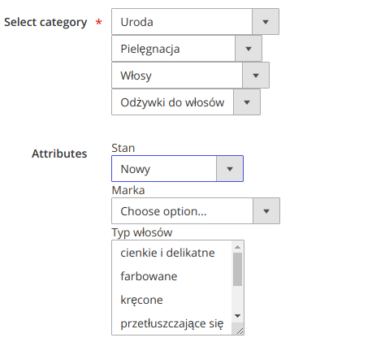

Wszystkie pola w formularzu mają walidację, niektóre parametry mogą być wymagane do wystawienia aukcji.
Oferta wystawiana jest ze zdjęciami pobranymi z produktu.

Po uzupełnieniu wszystkich pół i kliknięciu "Zapisz" - zostanie wystawiony szkic oferty na Allegro i zostaniemy przekierowani na stronę edycji oferty. Teraz wystarczy kliknąć "Opublikuj", aby oferta stała się aktywna. W każdej chwili możemy edytować ofertę, zakończyć ją, a potem następnie aktywować. Produkt jest już teraz powiązany z ofertą na Allegro.
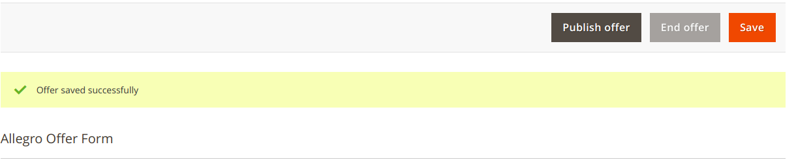

## Konfiguracja MYSQL MQ

dodać kolejkę w tabeli `queue` w bazie danych

`` INSERT INTO queue (name) VALUES ('allegro.api'); ``


konfiguracja w pliku config.php
````
<?php
return [
    'modules' => [
    // ...
    'Magento_Amqp' => 0, // important disable rabbitmq
    'Magento_MysqlMq' => 1,
    // ...
    ]
````

konfiguracja kolejki w pliku env.php

````
    'queue' => [
        'topics' => [
            'allegro.change.stock.db' => [
                'schema' => [
                    'schema_value' => 'Macopedia\Allegro\Api\Consumer\MessageInterface'
                ],
                'response_schema' => [
                    'schema_value' => 'Macopedia\Allegro\Api\Consumer\MessageInterface'
                ],
                'publisher' => 'allegro.change.stock.db',
            ],
        ],
        'publishers' => [
            'allegro.change.stock.db' => [
                'name' => 'allegro.change.stock.db',
            ]
        ],
        'consumers' => [
            'allegro.change.stock.db' => [
                'queue' => 'allegro.api', // `name` from db table `queue`
                'name' => 'allegro.change.stock.db',
                'handlers' => [
                    [
                        'type' => 'Macopedia\Allegro\Model\Consumer',
                        'method' => 'processMessage'
                    ]
                ],
                'consumerInstance' => 'Magento\Framework\MessageQueue\Consumer',
                'instance_type' => 'Magento\Framework\MessageQueue\Consumer',
                'connection' => 'db',
                'maxMessages' => 2000,
                'max_messages' => 2000
            ]
        ],
        'exchange_topic_to_queues_map' => [
            'allegro.change.stock.db--allegro.change.stock.db' => [
                'allegro.api' // `name` from db table `queue`
            ]
        ]
    ],
````
konfiguracja consumera w pliku env.php

````
    'cron_consumers_runner' => [
        'cron_run' => true,
        'max_messages' => 20000,
        'consumers' => [
            'AllegroApiQueueDb'
        ]
    ]
````

## Konfiguracja RABBITMQ

konfiguracja w pliku config.php
````
<?php
return [
    'modules' => [
    // ...
    'Magento_Amqp' => 1, // important enable rabbitmq
    // ...
    ]
````

konfiguracja kolejki w pliku env.php

````
    'queue' => [
        'amqp'   => [
            'host'     => 'amqp',
            'port'     => '5672',
            'user'     => 'guest',
            'password' => 'guest',
        ],
    ],
````
konfiguracja consumera w pliku env.php

````
    'cron_consumers_runner' => [
        'cron_run' => true,
        'max_messages' => 20000,
        'consumers' => [
            'AllegroApiQueue'
        ]
    ]
````

